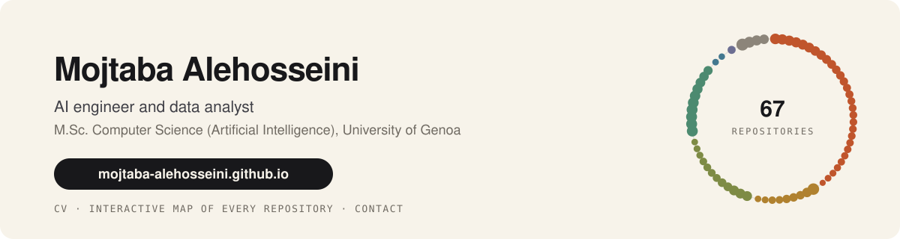

<a href="https://mojtaba-alehosseini.github.io/">
  <picture>
    <source media="(prefers-color-scheme: dark)" srcset="assets/banner-dark.svg">
    
  </picture>
</a>

  
  
  
  

AI engineer and data analyst. I build machine-learning systems from the data pipeline to the trained model and the dashboard on top, and I finish an M.Sc. in Computer Science (Artificial Intelligence) at the University of Genoa in February 2027. Before Italy: four years at a carpet manufacturer, first running the servers, then building the Power BI reporting its managers plan from, and 28 months co-running a 100-GPU compute fleet.

## Publication

  

**Intelligent Orthopedics: Machine Learning in Diagnosis of Bone Disease, Implants, and Bone Health Monitoring.** Kamaei M., Mohammadi H., Golafshan S., **Alehosseini M.**, et al. *Advanced Healthcare Materials*, 2026, e71447.

I co-wrote the machine-learning section: problem formulation and learning paradigms, imaging-data preprocessing, model selection and training, and evaluation and interpretability, applied to bone-disease diagnosis, patient-specific implants and bone-healing prediction.

## Recent work

<table>
<tr>
<td width="50%" valign="top">

**[Port Command Genova](https://github.com/Mojtaba-Alehosseini/Port-Command)** 
A port-management game commanded in plain English. Ten JADE agents negotiate tug escorts through FIPA Contract-Net auctions, a SWI-Prolog rule base of about 30 rules gates every move, a Prolog DCG parses the negotiation sentences with a Rasa fallback, and a local LLM explains each decision without adding facts. 
    

</td>
<td width="50%" valign="top">

**RAE-DiT: diffusion transformers on DINOv2 latents** 
Scaled reproduction of NYU's RAE-DiT on one P100: frozen DINOv2-B encoder, pretrained ViT-XL decoder, a 196M-parameter DiTDH-S trained with flow matching on cached 768×16×16 latents. Dimension-dependent noise schedule, classifier-free guidance, a paired held-out loss and a seeded schedule ablation scored by FID (111.99 unguided, 105.83 guided). 13-page report, every number traceable to a notebook cell. 
   

</td>
</tr>
<tr>
<td width="50%" valign="top">

**[Parallel dense matrix multiplication](https://github.com/Mojtaba-Alehosseini/hpc-gemm-openmp-mpi-cuda)** 
Double-precision GEMM as sequential, OpenMP, MPI and CUDA kernels on an i9-12900K, a Tesla T4 and a Tesla P100: MPI 6.47× over the best sequential kernel, CUDA on the P100 27.4×. The T4 loses to the CPU, and the report shows why (FP64 at 1:32). 33 pages, Intel Advisor and Nsight profiles, predictions registered before the P100 run. 
   

</td>
<td width="50%" valign="top">

**[The Price of Europe](https://mojtaba-alehosseini.github.io/The-Price-of-Europe/)** · [code](https://github.com/Mojtaba-Alehosseini/The-Price-of-Europe) 
How life got expensive in Europe, 2019 to 2025. A scroll-driven data essay: nine chapters, eleven hand-built D3 v7 charts, a reproducible Eurostat pipeline whose currency and unit filters catch silently stacked series, offline scripts that recompute every figure the text claims. No framework, no build step. 
   

</td>
</tr>
</table>

Also on GitHub: [nl-to-sql-genbi](https://github.com/Mojtaba-Alehosseini/nl-to-sql-genbi) (plain-English questions to read-only SQL, 60 tests), [demand-forecasting](https://github.com/Mojtaba-Alehosseini/demand-forecasting) (WAPE 17% against 44% naive), [onnx-inference-service](https://github.com/Mojtaba-Alehosseini/onnx-inference-service) (INT8 serving 2.6× faster than PyTorch), [cs-migration-compass](https://mojtaba-alehosseini.github.io/cs-migration-compass/) (73 cities compared on sourced data), and a geospatial U-Net that finds volcanic cones in elevation models (Computational Vision project, report on request).

## Stack

Plus CUDA, OpenMP and MPI, SWI-Prolog and JADE, Power BI and Power Query, Claude Code with MCP servers and custom skills.

## How I work

Claude Code is part of my daily toolchain, in English, for the projects above. Separately, for Persian-speaking users I maintain [persian-skill](https://github.com/Mojtaba-Alehosseini/persian-skill), a Claude skill for English to Persian translation and Persian typography (RTL, ZWNJ, digits). The two are unrelated: one is how I build, the other is something I built.

## Find me

The site has the CV, two interactive maps of these 61 repositories (a ring by field and language, and a radar you can spin) and a portrait you can crumple with your hand:

**[mojtaba-alehosseini.github.io](https://mojtaba-alehosseini.github.io/)** · [LinkedIn](https://www.linkedin.com/in/mojtaba-alehosseini/) · alehoseini.mojtaba@gmail.com
